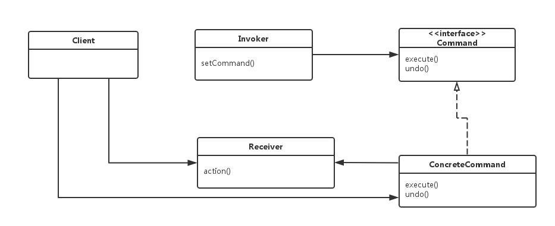
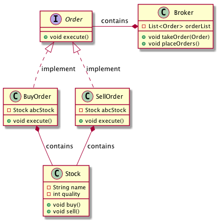

# 行为模式-命令模式（Command）
在软件设计中，我们经常会遇到某些对象发送请求，然后某些对象接受请求后执行，但发送请求的对象可能并不知道接受请求的对象是谁，执行的是什么动作。此时可通过 命令模式 来实现，让发送者和接受者完全的松耦合，这样可大大增强程序的灵活性。
命令模式 将“请求”封装成对象，以便使用不同的请求，队列或者日志来参数化其他对象。命令模式也支持可撤销的操作。
#### 组成

```
Client(客户)：负责创建一个具体的命令（Concrete Command）
Invoker（调用者）：调用者持有一个命令对象，并在某个时刻调用命令对象的execute方法
Command（命令接口）：包含命令对象的execute方法和undo方法
Receiver（接收者）：接收命令并执行
```
#### 实现
我们首先创建作为命令的接口 Order，然后创建作为请求的 Stock 类。实体命令类 BuyOrder 和 SellOrder，实现了 Order 接口，将执行实际的命令处理。创建作为调用对象的类 Broker，它接受订单并能下订单。Broker 对象使用命令模式，基于命令的类型确定哪个对象执行哪个命令。



#### 代码
Stock类
```java
public class Stock {
    private String name = "ABC";
    private int quality = 10;

    public void buy() {
        System.out.printf("买入【%d】股【%s】股票。\n", quality, name);
    }

    public void sell() {
        System.out.printf("卖出【%d】股【%s】股票。\n", quality, name);
    }
}
```
Order、BuyOrder、SellOrder类
```java
public interface Order {
    void execute();
}
public class BuyOrder implements Order {
    private Stock abcStock;

    public BuyOrder(Stock stock) {
        this.abcStock = stock;
    }

    @Override
    public void execute() {
        abcStock.buy();
    }
}

public class SellOrder implements Order {
    private Stock abcStock;

    public SellOrder(Stock stock) {
        this.abcStock = stock;
    }

    @Override
    public void execute() {
        abcStock.sell();
    }
}
```
Borker类
```java
public class Broker {
    private List<Order> orderList = new ArrayList<>();

    public void takeOrder(Order order) {
        orderList.add(order);
    }

    public void placeOrders() {
        for (Order order : orderList) {
            order.execute();
        }
        orderList.clear();
    }
}
```

使用
```java
public class Demo {
    public static void main(String[] args) {
        Stock abcStock = new Stock();
        Broker broker = new Broker();

        broker.takeOrder(new BuyOrder(abcStock));
        broker.takeOrder(new SellOrder(abcStock));

        broker.placeOrders();
    }
}
```
结果
```
买入【10】股【ABC】股票。
卖出【10】股【ABC】股票。
```
