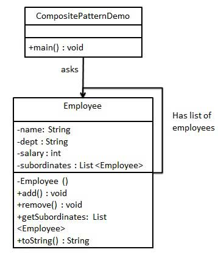

# 结构模式-组合模式(Composite)
> 组合模式又叫部分整体模式,用于把一组相似的对象当做一个单一的对象。组合模式移居树形结构来组合对象，用于表示部分以及整体层次。它创建了对象组的树形结构。
> 组合模式使得用户对单个对象和组合对象的使用具有一致性.

#####实现
我们有一个类 Employee，该类被当作组合模型类。CompositePatternDemo，我们的演示类使用 Employee 类来添加部门层次结构，并打印所有员工。



Employee代码

```java
@Data
public class Employee {
    private String name;
    private String dept;
    private int salary;
    private List<Employee> subordinates;

    public Employee(String name, String dept, int salary) {
        this.name = name;
        this.dept = dept;
        this.salary = salary;
        this.subordinates = new ArrayList<>();
    }

    public void add(Employee employee) {
        subordinates.add(employee);
    }

    public void remove(Employee employee) {
        subordinates.remove(employee);
    }
}
```
使用
```java
        Employee cto = new Employee("Zhou", "CTO", 50000);
        Employee headSales = new Employee("Robert", "Head Sales", 20000);
        Employee headMarketing = new Employee("Michel", "Head Marketing", 20000);
        Employee clerk1 = new Employee("Laura", "Marketing", 10000);
        Employee clerk2 = new Employee("Bob", "Marketing", 10000);
        Employee salesExecutive1 = new Employee("Richard", "Sales", 10000);
        Employee salesExecutive2 = new Employee("Rob", "Sales", 10000);

        cto.add(headSales);
        cto.add(headMarketing);

        headSales.add(salesExecutive1);
        headSales.add(salesExecutive2);
        headMarketing.add(clerk1);
        headMarketing.add(clerk2);
```
