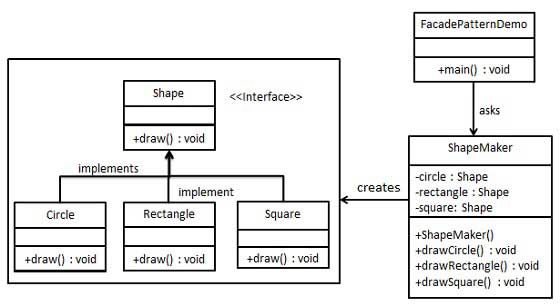

# 结构模式 01-外观模式

> Facade模式的定义: 外观模式隐藏系统的复杂性，并向客户端提供了一个客户端可以访问系统的接口，它向现有的系统添加一个接口，来隐藏系统的复杂性。

>我们将创建一个 Shape 接口和实现了 Shape 接口的实体类。下一步是定义一个外观类 ShapeMaker。ShapeMaker 类使用实体类来代表用户对这些类的调用



```
Shape:形状接口
Circle:Shape实现类，圆
Rectangle:Shape实现类，矩形
Square:Shape实现类，正方形
ShapeMaker:形状创造类
```
Shape接口代码
```java
public interface Shape {
    void draw();
}
```
Circle类代码
```java
public class Circle implements Shape {
    @Override
    public void draw() {
        System.out.println("circle");
    }
}
```
Rectangle类代码
```java
public class Rectangle implements Shape {
    @Override
    public void draw() {
        System.out.println("rectangle");
    }
}
```
Square类代码
```java
public class Square implements Shape {
    @Override
    public void draw() {
        System.out.println("square");
    }
}
```
ShapeMaker类代码
```java
public class ShapeMaker {
    private Circle circle;
    private Rectangle rectangle;
    private Square square;

    public ShapeMaker() {
        this.circle = new Circle();
        this.rectangle = new Rectangle();
        this.square = new Square();
    }

    public void drawCircle() {
        circle.draw();
    }

    public void drawRectangle() {
        rectangle.draw();
    }

    public void drawSquare() {
        square.draw();
    }
}
```
ShapeMaker使用
```java
        ShapeMaker maker = new ShapeMaker();
        maker.drawCircle();
        maker.drawRectangle();
        maker.drawSquare();
```

