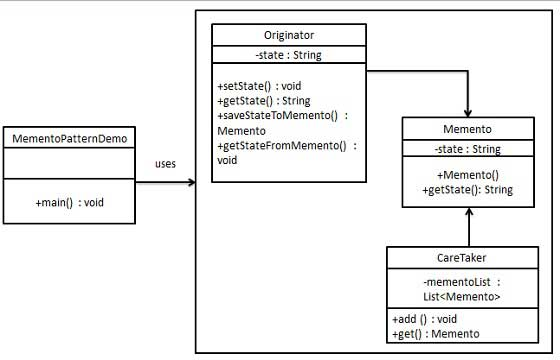

# 行为模式-备忘录模式（Memento）
备忘录模式保存了一个对象的某个状态，以便在适当的时候恢复对象。
在不破坏封装性的前提下，捕获一个对象的内部状态，并在该对象之外保存这个状态。这样可以在以后将对象恢复到原先保存的状态。
#### 实现
备忘录模式使用三个类 Memento、Originator 和 CareTaker。Memento 包含了要被恢复的对象的状态。Originator 创建并在 Memento 对象中存储状态。Caretaker 对象负责从 Memento 中恢复对象的状态。


#### 代码
Memento类
```java
public class Memento {
    private String state;

    public Memento(String state) {
        this.state = state;
    }

    public String getState() {
        return state;
    }
}
```
Originator类
```java
@Data
public class Originator {
    private String state;

    public Memento saveStateToMemento() {
        return new Memento(state);
    }

    public void getStateFromMemento(Memento memento) {
        this.state = memento.getState();
    }

}
```
CareTaker类
```java
public class CareTaker {
    private List<Memento> mementoList = new ArrayList<>();

    public void add(Memento memento) {
        mementoList.add(memento);
    }

    public Memento get(int index) {
        return mementoList.get(index);
    }
}

```
使用
```java
public class Demo {
    public static void main(String[] args) {
        Originator originator = new Originator();
        CareTaker careTaker = new CareTaker();
        originator.setState("State #1");
        originator.setState("State #2");
        careTaker.add(originator.saveStateToMemento());
        originator.setState("State #3");
        careTaker.add(originator.saveStateToMemento());
        originator.setState("State #4");
        System.out.printf("当前状态：【%s】。\n",originator.getState());
        originator.getStateFromMemento(careTaker.get(0));
        System.out.printf("当前状态：【%s】。\n",originator.getState());
        originator.getStateFromMemento(careTaker.get(1));
        System.out.printf("当前状态：【%s】。\n",originator.getState());

    }
}

```
结果
```
当前状态：【State #4】。
当前状态：【State #2】。
当前状态：【State #3】。
```


