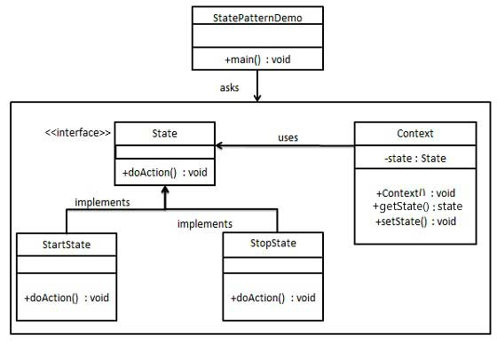

# 行为模式-状态模式（State）
在状态模式中，类的行为是根据其状态改变的。在状态模式中，我们创建各种状态的对象和一个行为跟着对象改变而改变的context对象。
允许对象在内部状态发生改变时改变它的行为，对象看起来好像修改了它的类。
对象的行为依赖于它的状态（属性），并且可以根据它的状态改变而改变它的相关行为。

#### 实现
我们将创建一个 State 接口和实现了 State 接口的实体状态类。Context 是一个带有某个状态的类。


####  代码
State接口
```java
public interface State {
    void doAction(Context context);
}
```
StartState类
```java
public class StartState implements State {
    @Override
    public void doAction(Context context) {
        System.out.println("开始");
        context.setState(this);
    }
}
```
StopState类
```java
public class StopState implements State {
    @Override
    public void doAction(Context context) {
        System.out.println("结束");
        context.setState(this);
    }
}
```
Context类
```java
@Data
public class Context {
    private State state;
    public Context() {
    }
}
```
使用
```java
public class Demo {
    public static void main(String[] args) {
        Context context = new Context();
        State startState = new StartState();
        State stopState = new StopState();

        startState.doAction(context);
        System.out.printf("context的状态：【%s】\n",context.getState());
        stopState.doAction(context);
        System.out.printf("context的状态：【%s】\n",context.getState());
    }
}
```
结果
```
开始
context的状态：【com.zhou.pattern.state.StartState@4629104a】
结束
context的状态：【com.zhou.pattern.state.StopState@27f8302d】
```