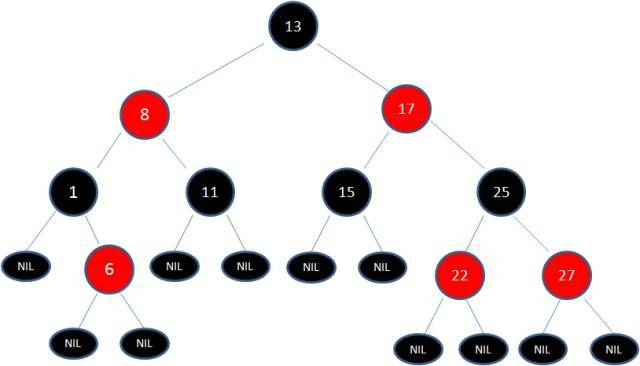
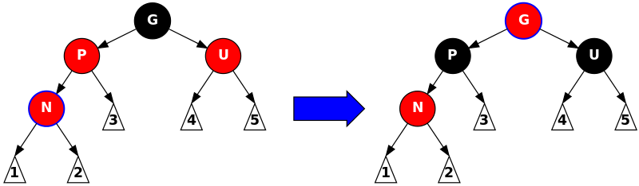

# 树
- - - - -
## 二叉树（Binary Search Tree）
二叉树特性
1. 左子树上所有结点的值均小于或等于它的根结点的值。
2. 右子树上所有结点的值均大于或等于它的根结点的值。
3. 左、右子树也分别为二叉排序树。
4.  查找所需的最大次数等于树的高度（二分查找思想）
5. 极端情况下，二叉树类似链表结构，即所有的子节点都只有一个根结点（红黑树解决的正是此类问题）
- - - ---
## 红黑树（Red Black Tree）
[参考链接1](https://www.sohu.com/a/201923614_466939)
[参考链接2](https://en.wikipedia.org/wiki/Red%E2%80%93black_tree)
红黑树是一种自平衡的二叉树，除了具有二叉树的特征外，它还有以下规则：
1. 节点是红色或黑色
2. 根结点是黑色
3. 每个叶子节点（NIL节点）都是黑色的空节点
4. 每个红色节点的子节点只能是黑色的（从每个叶子节点到根结点不能有两个连续的红节点）
5. 从任一节点到其每个叶子的所有路径都包含相同数目的黑色节点

>下图就是一颗典型的红黑树



 **红黑树基本操作（一） 左旋右旋 **
红黑树的基本操作是添加、删除。在对红黑树进行添加删除之后都会用到旋转方法，因为在添加、删除操作之后，红黑树的结构发生了变化，可能不满足红黑树的5中特性，也就不是一颗红黑树了。而通过旋转可以让这棵树重新称为红黑树。
1. 左旋

 

2. 右旋


**红黑树基本操作（二）添加**
添加节点步骤：
1. 首先，将红黑树作为二叉树插入节点；
2. 然后将该节点着色为红色；（可能违背特性4）
3. 最后通过旋转和重新着色等方法修正该树，使之重新成为一颗红黑树。

``` 
G：祖父节点
P：父节点
U：叔父节点
N：新增的当前节点
```
新建节点时，需要处理的场景如下：
1. N是根结点
2. N的父节点P是黑色
3. P是红色，P的兄弟节点U也是红色
4. P是红色的，U是黑色
```
场景1和场景2不需要处理；
场景3，场景4因为无法维持红黑树，需要进行调整
```
场景3的处理状况：

>如果P和U节点都是红色，将它们重新着色为黑色，将G节点着色为红色。这是从G节点往下都会符合红黑树规则，但G有可能不满足规则2（根结点必须为黑色）或者规则4（红色节点只能有黑色的字节点），为了符合这些规则，会把G节点作为N节点重新修复为红黑树。

场景4的处理状况

状况 | 描述 | 解决方式
--- | --- | --- 
  1 | N在G的内部(N是P的右孩子，P是G的左孩子；或者N是P的左孩子，P是G的右孩子)|以P为支点进行左旋，旋转后N会被换到G的外部，状况1变为状况2
  2 |N在G的外部(N是P的右孩子，P是G的右孩子；或者N是P的左孩子，P是G的左孩子) |有G为支点进行右旋，并且P和G进行颜色交换

状况1


状况2


**在上面的算法中除了场景3的处理方式可以重复使用外，其他的算法只能使用1次。**


